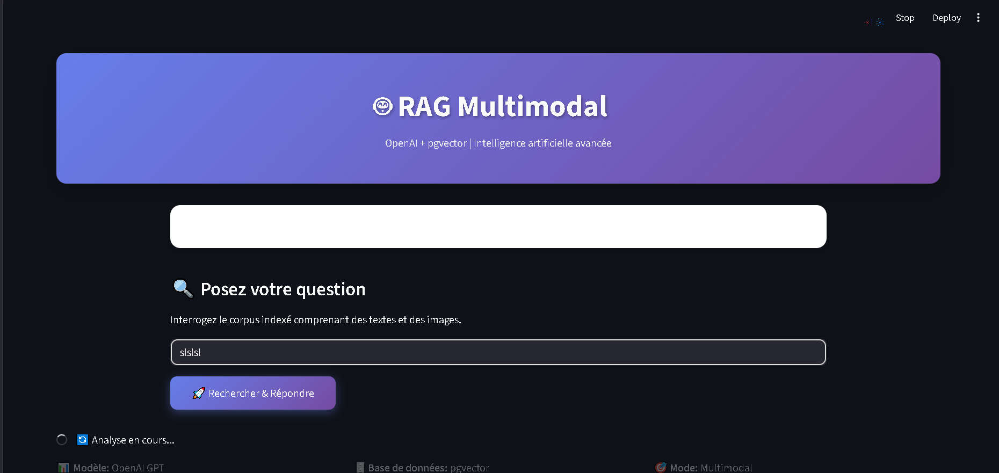
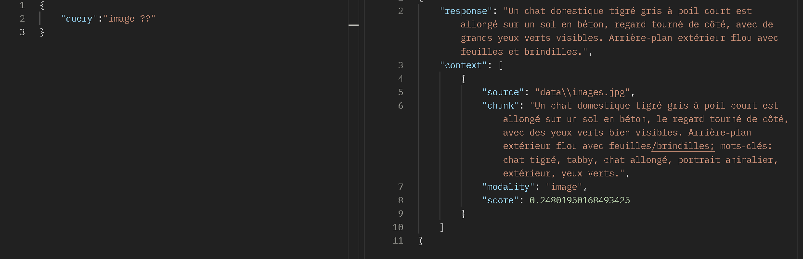

# 🤖 TP RAG Multimodal

A **Retrieval-Augmented Generation (RAG) multimodal application** using OpenAI and pgvector.  
This project allows querying a mixed corpus of **text and images** and getting AI-generated responses.  

The server also exposes a **REST API** to interact with other apps.

---

## 🗂 Project Structure


├── assets/shortcut
│ └── rag_view.png # Screenshot / visual reference
├── data/ # Storage for vector data or other resources
├── venv/ # Python virtual environment
├── .env # Environment variables
├── api.py # REST API for external apps (/chat)
├── db.py # Database utilities
├── db.sql # Database schema
├── docker-compose.yml # Docker setup
├── ingest.py # Script to index data into pgvector
├── main.py # Streamlit web app
├── openai_utils.py # OpenAI API helper functions
├── rag_core.py # Core RAG logic (query processing)
├── requirements.txt # Python dependencies

---


---

## ⚡ Features

- ✅ Query indexed corpus (text)  
- ✅ Display top 5 relevant context chunks  
- ✅ Multimodal RAG powered by OpenAI  
- ✅ Streamlit frontend  
- ✅ REST API for other apps (`/chat`)  

---

## 🚀 Getting Started

### 1. Clone the repository

```bash

git clone https://github.com/BilalZouine/smart_student_app_rags.git

cd ./smart_student_app_rags

python -m venv venv
source venv/bin/activate      # Linux / Mac
venv\Scripts\activate         # Windows

pip install -r requirements.txt

```

---

## Example Configuration

Create a `.env` file with the following example settings:

```env
# PostgreSQL / pgVector configuration
PG_HOST=localhost
PG_PORT=5432
PG_DB=ragdb
PG_USER=your_username
PG_PASSWORD=your_password

# OpenAI API Key
OPENAI_API_KEY=your_openai_api_key


```

## Example Docker Compose for pgVector

```yaml
version: "3.9"

services:
  pgvector:
    image: pgvector/pgvector:pg16
    container_name: pgvector_rag
    environment:
      POSTGRES_USER: "your_username"
      POSTGRES_PASSWORD: "your_password"
      POSTGRES_DB: ragdb
    ports:
      - "5432:5432"
    volumes:
      - pgdata_rag:/var/lib/postgresql/data

volumes:
  pgdata_rag:
```
---

### 🖥 Running the Streamlit app
```bash
streamlit run main.py
```
--- 

### Access the app at:
[http://localhost:8501](http://localhost:8501)

---

### 🌐 Running the API server
```bash
uvicorn main:app --reload --host 0.0.0.0 --port 6000
```

The server runs on port 6000

Main endpoint: /chat

Example request:

```bash
POST http://localhost:6000/chat
Content-Type: application/json

{
  "query": "Votre question ici"
}
```
---

### 🛠 Technologies
- Python 3.9+ 
- [Streamlit](https://streamlit.io/) ↗
- [OpenAI Chat](https://openai.com/) ↗
- [pgVector](https://www.pgvector.org/) ↗
- PostgreSQL (vector database)
- Docker (optional, via docker-compose)


### 📸 Screenshot

#### web


#### api

